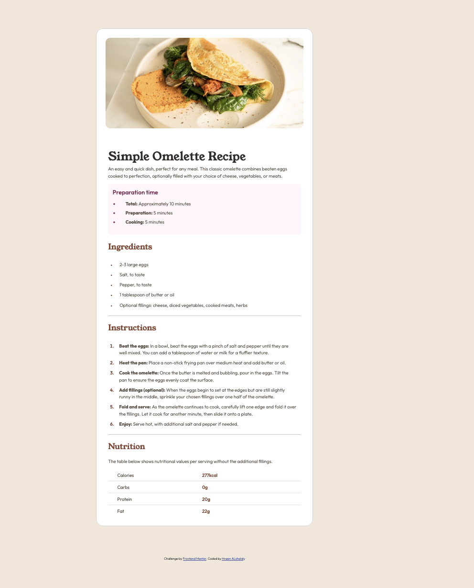
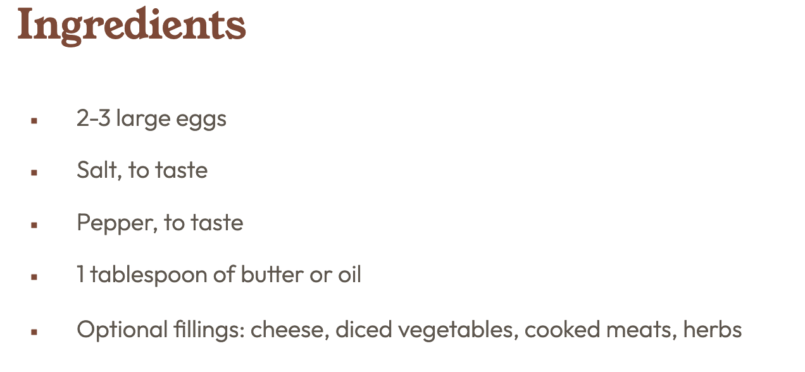
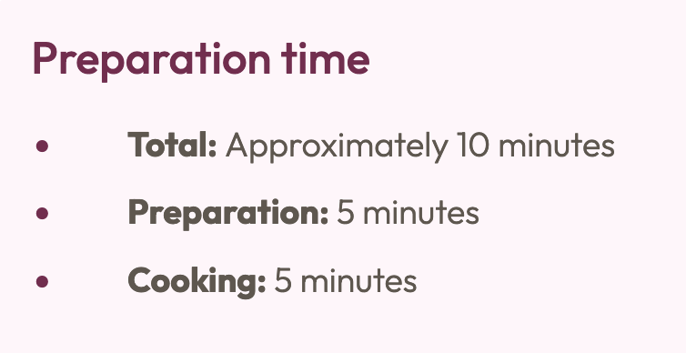

# Frontend Mentor - Recipe page solution

This is a solution to the [Recipe page challenge on Frontend Mentor](https://www.frontendmentor.io/challenges/recipe-page-KiTsR8QQKm). Frontend Mentor challenges help you improve your coding skills by building realistic projects. 

## Table of contents

- [Overview](#overview)
  - [The challenge](#the-challenge)
  - [Screenshot](#screenshot)
  - [Links](#links)
- [My process](#my-process)
  - [Built with](#built-with)
  - [What I learned](#what-i-learned)
  - [Continued development](#continued-development)
  - [Useful resources](#useful-resources)
- [Author](#author)
- [Acknowledgments](#acknowledgments)

**Note: Delete this note and update the table of contents based on what sections you keep.**

## Overview

### Screenshot



### Links

- Solution URL: [Add solution URL here](https://your-solution-url.com)
- Live Site URL: [Add live site URL here](https://your-live-site-url.com)

## My process

### Built with

- Semantic HTML5 markup
- CSS custom properties
- Flexbox
- CSS Grid
- Mobile-first workflow
- [Bootstrap](https://getbootstrap.com/) - CSS framework


### What I learned

- breaking mid-large task to small ones and deal with them as todos make the development easier

- build HTML step by step along with CSS Design and then go to the next Block of the page 

-useing rem Instead of px more Efficient for RWD (Responsive Web Design)

- using the below code help with control list marker when changing the its color:

 
```css
.container .card .PreparationTime ul>li::marker{
    color: var(--DarkRaspberry);
}
```

### Continued development

- build a good RWD with Different Screen sizes 

### Useful resources

- [HTML Lists and CSS List Properties](https://www.w3schools.com/css/css_list.asp) - This helped me for Customise ul Element. 
- [Bootstap - Tables](https://getbootstrap.com/docs/5.3/content/tables/#accented-tables) - This is an amazing page which helped me to build Excellent tabal.


## Author

- Website - [Add your name here](https://www.your-site.com)
- Frontend Mentor - [@yourusername](https://www.frontendmentor.io/profile/yourusername)
- Twitter - [@yourusername](https://www.twitter.com/yourusername)

**Note: Delete this note and add/remove/edit lines above based on what links you'd like to share.**

## Acknowledgments

This is where you can give a hat tip to anyone who helped you out on this project. Perhaps you worked in a team or got some inspiration from someone else's solution. This is the perfect place to give them some credit.

**Note: Delete this note and edit this section's content as necessary. If you completed this challenge by yourself, feel free to delete this section entirely.**
